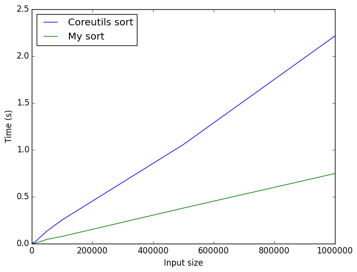

## What is this?
This is program sorts a file containing numbers between 0 and 2^64 - 1, each
on a line by its own. It is written x86-64 assembly. Its purpose is to be as
fast as possible. Here, "as fast as possible" is basically "faster than
coreutils sort", which I achieved for this specific type of data.

## Why would you submit yourself to such torture?!
This was an assignment assigned to us in our Computer Architecture class.
To be specific, the goal was to write a program in x86-64 assembly that
would accept a filename via the command line and sort all the numbers
within, and then output them to standard output.

Additionally, the teacher promised prizes for those who could write the
smallest(compiled size) and fastest implementations, respectively. The code
in this repository is the result of my efforts to write the fastest code.
Although the results aren't in yet, I am confident that I managed to do this
after asking around a bit. An additoinal goal that I hoped to accomplish was
to beat the built-in coreutils sort program, which I managed to do.

## How?
The algorithm I chose to implement was
[Radix Sort](http://www.wikipedia.org/wiki/Radix_Sort) using
[Counting Sort](http://www.wikipedia.org/wiki/Counting_Sort). Since we know
that the data is between 0 and 2^64 - 1(i.e. each number uses a maximum of 8
bytes), we know we only have to perform 8 passes of the data.

## Results
Here is a plot showing the average time taken to sort files containing
10, 100, 1000, 5000, 10000, 50000, 100000, 500000 and 1000000 numbers. 20
different, randomly generated files are sorted for each size and the times
averaged for both programs.

As can be seen, both are quite clearly linear. I have not looked into the
reasons for the differences in speed between both programs. Cursory analysis
of the output of `perf stat` shows differences in context switches and page
faults, and the speed difference might simply stem from the fact that the
built-in sort is parallelized and the overhead from synchronization is
rather high.

The tests above were performed on my very, very slow dual-core Intel Celeron
laptop. Since coreutils sort is parallelized, I wondered if it might beat my
implementation were it allowed to scale to more cores. After testing on quad
core machines at school as well as here at home, that does not seem to be
the case.

## Usage
Running `make` will build the program. Running `python testsuite.py -g
graph.png` will give you a graph like the one above. For additional options
that can be tweaked, see the output from `python testsuite.py -h`

**Note:** You need python 3 to run the test suite, and GNU binutils for `as`
and `ld`.

## Known limitations & Bugs

